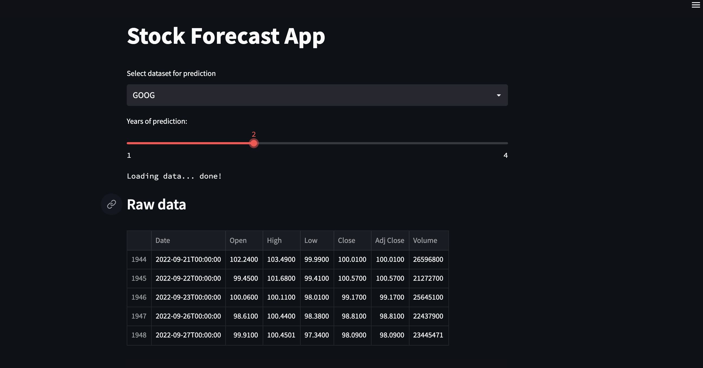
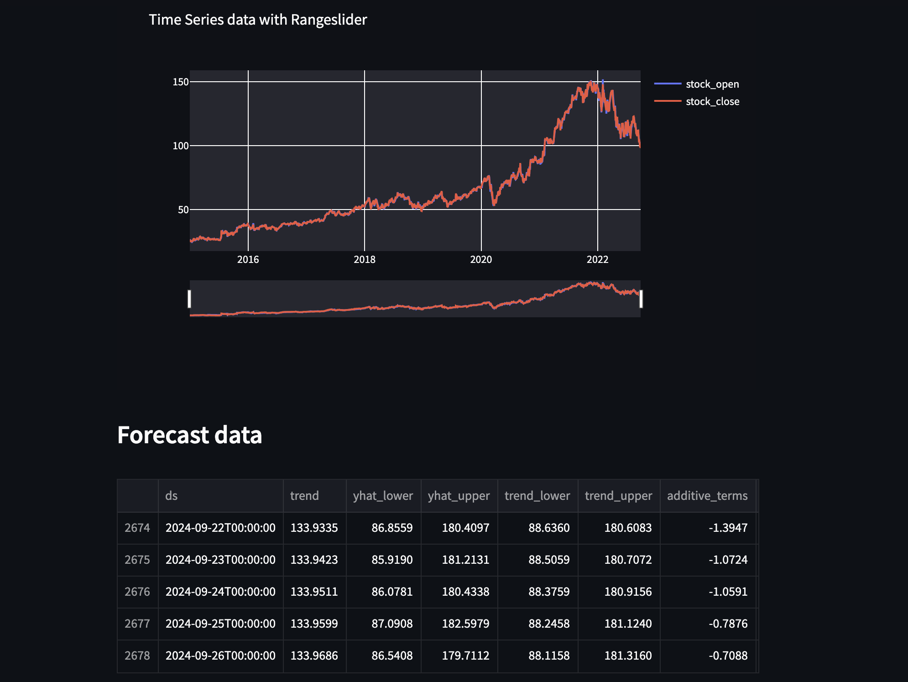
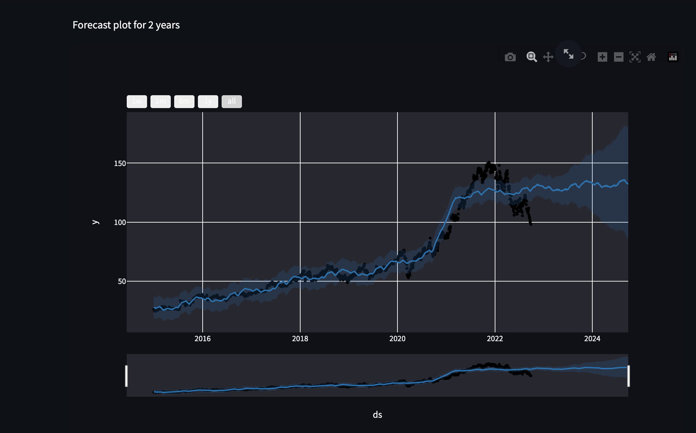

# stock_market_analyser
An Interactive Web App designed to predict the stock trend in coming years of specified stock in specified years.
● Implemented using the Facebook prophet to get automated forecasts and yahooFinance to get stock data.
● Tech Stack: Python3, Plotly, STREAMLIT

Features:

● Variable years of prediction

● RangeSlider to focus on particular day/week/month.

●Future Prediction

